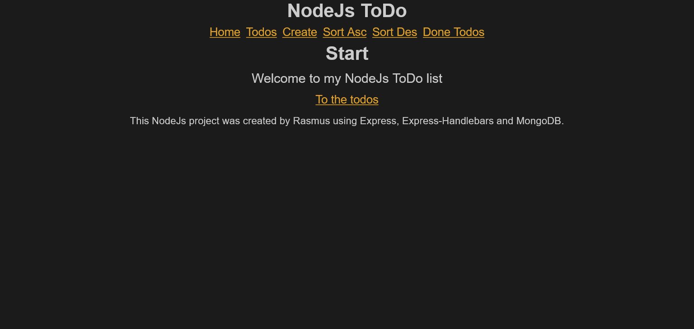

## Table of contents

- [Overview](#overview)
  - [Nodejs-TODO](#nodejs-tODO)
  - [Project setup](#project-setup)
  - [Built with](#built-with)
  - [Screenshot](#screenshot)
  - [Author](#author)

## Overview

### Nodejs-TODO

Welcome to a Node Js To do list.

This is a to do list from Medieinstitutet Stockholm Sweden.

NodeJs is required to use this project.
To install it use this link: https://nodejs.org/en/

A MongoDB connection string is required to run this application.

If you have a connection string:
Create the .env file in the root and paste the string in there.

```
MONGODB_CONNECTION_STRING = ""
```

## Project setup

```
npm install
```

### Compiles and hot-reloads for development

```
nodemon
```

### Built with

- html
- scss/sass
- javascript
- node.js
- mongodb
- express.js
- handlebars
- template engines
- forms

### Screenshot



### Author

[Github](https://github.com/Rasweb)

[Website](https://rasweb.one/)
